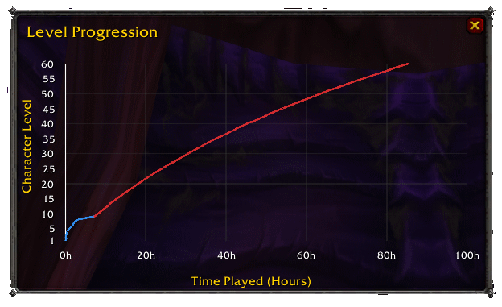
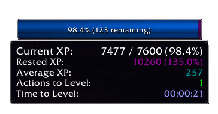

# xpInfo

A comprehensive World of Warcraft Classic addon that tracks your character's experience progression, leveling efficiency, and provides detailed statistics and visualizations.

  
   <em>Get a visual timeline of your leveling progress</em>

  
   <em>Some interesting states when overing the XP bar</em>

## Key Features

- 📊 Stats Frame - XP tracking, progression metrics, and time estimates
- 📈 Level Graph - Visual timeline of your leveling progress  
- ⚡ XP Bar - Standalone movable XP bar with detailed tooltips
- 🗺️ Minimap Icon - Quick access to all features
- 🧮 Recent Rate Estimation - Time-to-max-level is now calculated using your recent leveling pace (last 5 snapshots), for more realistic and responsive predictions
- 📱 Data Management - Historical snapshots and progression analysis

## Quick Start

1. **Install**: Extract to `World of Warcraft\_classic_era_\Interface\AddOns\xpInfo\`
2. **Setup**: Use `/xpi config` to configure settings
3. **Usage**: All frames are movable and remember their positions

## Essential Commands

- `/xpi config` - Open settings
- `/xpi toggle` - Toggle stats frame
- `/xpi toggle xpbar` - Toggle XP bar
- `/xpi estimate` - Show time-to-max-level estimate

## Features Overview

### Stats Frame
Shows current XP, rested XP, average XP per action, estimated actions to level, time to level, and time-to-max-level predictions.

### Level Progression Graph
Visual chart of your leveling timeline with configurable max level (10-80, default 60). Includes estimated completion projection.

### Standalone XP Bar  
Clean XP bar with rested XP overlay. Click to toggle stats, right-click to toggle graph.

### Time-to-Max-Level Estimation
- Uses your recent leveling rate (last 5 snapshots) for a realistic, up-to-date estimate
- No more blending or convergence to fixed values—estimates reflect your actual pace

## Configuration

Access via `/xpi config`:
- Toggle frame visibility
- Set max level for projections (10-80)
- Configure XP sample size (2-20)
- Customize tooltip positions
- Manage character profiles

## Compatibility

- **WoW Classic Era**: Interface 11507 ✅
- **Classic Era Servers**: Fully supported ✅  
- **Hardcore**: Compatible ✅
- **Retail**: Not Tested ❌

## Package Management
This project uses a `.pkgmeta` file to manage external libraries and dependencies. 
This file ensures that the correct versions of libraries are used and simplifies the process of updating them.

## More Information
For detailed documentation, algorithms, troubleshooting, and technical information, see [Details.md](Details.md)
